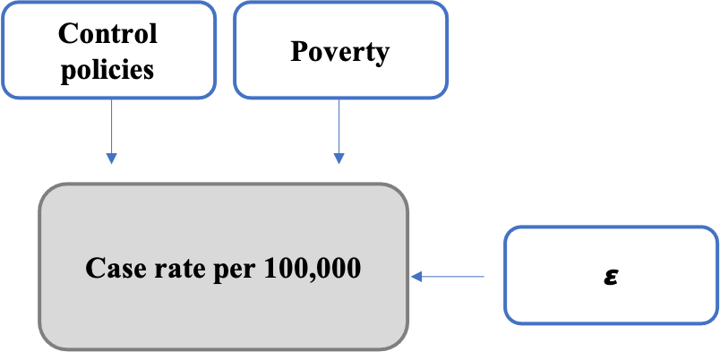
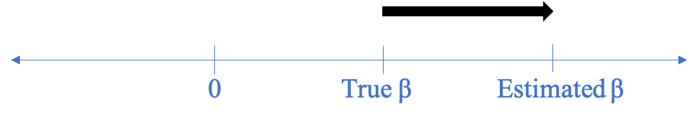
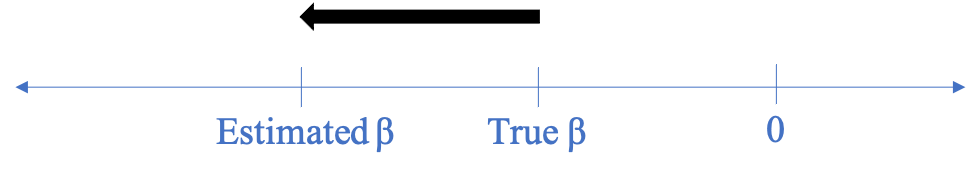

\tableofcontents

```{r setup, include=FALSE}
knitr::opts_chunk$set(echo = TRUE)
```

```{r load libraries, include=FALSE}
library("readxl")
library(tidyverse)
library(ggplot2)
library(dplyr)
library(sandwich)
library(patchwork)
library(lmtest)
library(stargazer)
library(car)
library(knitr)
```

## 1. Introduction

During the Covid-19 pandemic in the United States, news outlets and researchers have been analyzing which segments of the population are disproportionately impacted by the pandemic. According to [a recent CDC report](https://www.cdc.gov/mmwr/volumes/69/wr/mm6942a3.htm?s_cid=mm6942a3_w), communities with higher social vulnerability, such as counties with high percentages of people living in crowded housing conditions, are more likely to become Covid-19 hotspots whose residents suffer high levels of adverse health effects. Because of emerging research like this study, we were interested in understanding how poverty has affected the Covid-19 case rate, as we believe that communities with increased poverty rates are more impacted by Covid-19. 

In this analysis, we investigated: does poverty cause Covid-19 infections to spread more rapidly, increasing the number of cases? To answer this question, we developed an explanatory model relating poverty to Covid-19 infection rates using the `Covid-19.xlsx` dataset compiled by Majid Maki-Nayeri. This dataset includes information about the incidences of Covid-19 across all the 50 US states as well as the District of Columbia. Additionally, it includes information on state-level policy responses, changes to behavior as a result of the pandemic, and general state-level characteristics, such as population and racial makeup. U.S. states are highly varied in poverty rates, which allowed us to explore this question using this dataset. However, poverty levels are also highly varied within a state, and this dataset did not allow us to explore those differences.

## 2. Causal theory

Our theory, shown in Figure 1 below, is that both poverty and Covid-19 control policies have a causal effect on the Covid-19 case rate, as measured by the case rate per 100,000 people. 

```{r echo=FALSE, fig.align='center', out.width = '350px'}

```
\begin{center}
Figure 1: Causal Model
\end{center}

We believe that the case rate per 100,000 is highly affected by both the control policies implemented by the government in the different states and the poverty level in a state. We hypothesized that, in our dataset, increases in poverty would increase the case rate per 100,000 people, and that the implementation of control policies would decrease the case rate per 100,000. Our study analyzes different control measures, such as the implementation of a mask mandate, alongside indicators of poverty.

## 3. Model Building Process

Our outcome variable for this explanatory model of how poverty affects the Covid-19 case rate is the case rate per 100,000 population for each state in the United States. We selected this variable rather than a variable that represents the total number of cases because it allowed us to compare states that have very different populations. This number is also cumulative, including all cases reported between January 20, 2020, when the first known US infection was diagnosed, to October 30, 2020, when the dataset was last updated. 

This variable choice also allowed us to compare states that had a peak number of infections at different times. For example, New York's population is over 25 times as large as North Dakota's. New York's peak infections happened in March 2020, whereas North Dakota's case rate was still increasing in late October 2020, when this dataset was last updated. Using the case rate per 100,000 variable allowed us to compare these very different states and see that, adjusted for population, their outbreaks were at a similar scale.

After determining our outcome variable, we identified three variables as candidates to represent poverty in a state:

- `poverty`: Percent living under the federal poverty line. The poverty level data we are using is from 2018. We rely on the assumption that this data is still somewhat representative of 2020 poverty levels.
- `unemployment`: Percent unemployed (2018)
- `homeless`: Size of homeless population (2019)

We explored these variables to evaluate if we could use them in our model as signifiers of poverty. We began by checking each variable for errors and missing values. There were no missing values found, and the summary statistics did not indicate errors in the data. Then, in order to use the `homeless` variable to predict our outcome variable, `case_rate_100k`, we divided it by the state population and multiplied it by 100,000. We noted that the provided state population is for 2018 and the homeless count is for 2019. We are going to assume that the population change in the states between 2018 and 2019 was minimal.

```{r load the data, include=FALSE}
## Load the dataset.
data <- read_excel("covid-19.xlsx", sheet = 2, skip=1)
```

```{r, rename variables of interest, include=FALSE}
# should this code be included?
names(data)[names(data)=="Case Rate per 100000"] <- "case_rate_100k"
names(data)[names(data)=="Death Rate per 100000"] <- "death_rate_100k"
names(data)[names(data)=="Percent living under the federal poverty line (2018)"] <- 
  "poverty"
names(data)[names(data)=="Percent Unemployed (2018)"] <- "unemployment"
names(data)[names(data)=="Median Annual Household Income"] <- "income"
names(data)[names(data)=="Number Homeless (2019)"] <- "homeless"
names(data)[names(data)=="Population 2018"] <- "population"
names(data)[names(data)=="Medicaid Expenditures as a Percent of Total State Expenditures by Fund"] <- 
  "medicaid"
names(data)[names(data)=="White % of Total Population...14"] <- "white"
names(data)[names(data)=="Black % of Total Population...16"] <- "black"
names(data)[names(data)=="Hispanic % of Total Population...18"] <- "hispanic"
names(data)[names(data)=="Other % of Total Population...20"] <- "other"
names(data)[names(data)=="Population density per square miles"] <- "density"
names(data)[names(data)=="Children 0-18"] <- "children"
names(data)[names(data)=="Adults 19-25"] <- "adults_19_25"
names(data)[names(data)=="Adults 26-34"] <- "adults_26_34"
names(data)[names(data)=="Adults 35-54"] <- "adults_35_54"
names(data)[names(data)=="Adults 55-64"] <- "adults_55_64"
names(data)[names(data)=="65+"] <- "over_65"
names(data)[names(data)=="Tests per 100K"] <- "test"
names(data)[names(data)=="Workplaces"] <- "wp"
```


```{r, warning=FALSE, include=FALSE}
# Some variables have an incorrect type (e.g. `black` is detected as string). Will fix these cases.
options(digits=3)
data$medicaid <- as.double(data$medicaid)
data$black <- as.double(data$black)
```


```{r, include = FALSE}
# There are some states where the % of black population is represented by "<0.01". For this study we will assign a number less than 0.01 and close to zero (0.001).
# Should this be moved down to the race section?
data$black = ifelse(data$black %in% c(NA), 0.001, data$black)
```

```{r, include = FALSE}
# Let's do a quick quality check of these variables.
summary(data$poverty)
sum(is.na(data$poverty))
```

```{r, include = FALSE}
summary(data$unemployment)
sum(is.na(data$unemployment))
```

```{r, include = FALSE}
summary(data$homeless)
sum(is.na(data$homeless))
```

```{r}
data$homeless_100k <- (data$homeless / data$population)*100000
```

As seen in Figure 2 below, we plotted the relationship between each of our potential metrics for poverty and our outcome variable, case rate per 100,000 people, in order to consider the relationship between the outcome variable and the three variables related with poverty.

```{r, echo=FALSE,message=FALSE, fig.align='center', out.width = '85%'}
poverty_plot <- data %>% 
  ggplot(aes(x = poverty, y = case_rate_100k)) + 
  geom_point() +   
  labs(
    x = 'Percent Living under The Federal Poverty Line', 
    y = 'Case Rate Per 100,000'
  ) +
  geom_smooth(method = lm, se=FALSE)

homeless_plot <- data %>% 
  ggplot(aes(x = homeless_100k, y = case_rate_100k)) + 
  geom_point() +   
  labs(
    x = 'Number of Homeless Per 100,000', 
    y = 'Case Rate Per 100,000'
  ) +
  geom_smooth(method = lm, se=FALSE)

unemployment_plot <- data %>% 
  ggplot(aes(x = unemployment, y = case_rate_100k)) + 
  geom_point() +   
  labs(
    x = 'Percent of Unemployment', 
    y = 'Case Rate Per 100,000'
  ) +
  geom_smooth(method = lm, se=FALSE)

unemployment_plot + ggtitle('Cases vs. Unemployment') + homeless_plot + ggtitle('Cases vs. Homelessness') + poverty_plot + ggtitle('Cases vs. Poverty') +  plot_layout(ncol = 2)
```
\begin{center}
Figure 2: Metrics related to poverty vs. the case rate per 100,000
\end{center}

\newpage

Figure 3 below shows the correlation between these variables and our outcome variable.

 &nbsp; |Variable         | Correlation with Case Rate per 100,000 
-------|----------------|--------------------------------------
&nbsp; |Poverty          | 0.278
&nbsp; |Homeless per 100,000         |-0.167 
&nbsp; |Unemployment Rate           | -0.035

\begin{center}
Figure 3: Correlation of poverty variables and case rate per 100,000
\end{center}

```{r, echo=FALSE}
# correlation table between above three variables vs. the output variable
corr_table <- data.frame(cor(data$poverty, data$case_rate_100k),cor(data$homeless_100k, data$case_rate_100k),cor(data$unemployment, data$case_rate_100k))
colnames(corr_table)[1] = "poverty"
colnames(corr_table)[2] = "homeless_100k"
colnames(corr_table)[3] = "unemployment"
row.names(corr_table) <- "case_rate_100k"
# kable(head(corr_table))
```

We observed that, among the three variables considered to represent poverty, the variable `poverty` (percent living under the federal poverty line) had a more linear relationship (see Figure 2) and higher correlation (see Figure 3) with case rate per 100,000. Although the log transformation of the `homeless_100k` variable also had a linear relationship with our outcome variable, we determined that the `poverty` variable was more aligned with our research question, as it is a direct measure of poverty. For these reasons, we selected `poverty` as the key variable to use in our explanatory model of how poverty affects Covid-19 case rates. 

### Model 1

In order to focus on our primary research interest of poverty, we decided to start by modeling the relationship between poverty and the case rate per 100,000 without including any other variables. Subsequent analysis will include the control factors that we believe affect the case rate alongside poverty. 

```{r, warning=FALSE}
model1 <- lm(case_rate_100k ~ poverty , data=data)
se.model1 = sqrt(diag(vcovHC(model1)))
stargazer(model1,
          type="text", omit.stat="f",
          se=list(se.model1),
          star.cutoffs=c(0.05, 0.01, 0.001))
```
\begin{center}
Figure 4: Model 1
\end{center}


In this simple model, the coefficient of the `poverty` variable is significant. This first model explains about 6% of the variance of the outcome variable (case rate per 100,000 population.)

Interpretation of the coefficient:

- Holding all else equal, for every percentage point increase in people living under the federal poverty line, there are 111 more cases per 100,000 people in the state. 
- The number of cases also has practical significance. Our outcome variable `case_rate_100k` ranges from 344 to 5,589 cases per 100,000 population, so the increase of 111 cases for every percentage point increase in poverty is meaningful on the scale of the case rate. For the state with the lowest case rate per 100,000, a 1% increase in the poverty rate would cause a 32% increase in the case rate per 100,000. 

```{r}
summary(data$case_rate_100k)
```

### Model 2

In our second model, we added two variables that represent control measures imposed in the states to reduce the number of infections, as well as a control variable representing the states demographic makeup. 

- `mask`: variable to indicate states that have implemented a mask mandate in public places policy. [According to the experts](https://jamanetwork.com/journals/jama/fullarticle/10.1001/jama.2020.13107), wearing masks is one of the most important measures for controlling the spread of the disease. We created a binary variable to represent whether a state mandated wearing masks in public places or not.

- `democrat`: State Governor political affiliation. According to a [University of Washington study](https://www.medicalnewstoday.com/articles/republican-governors-took-longer-in-making-masks-a-requirement) and [this analysis by The Conversation](https://theconversation.com/democratic-governors-are-quicker-in-responding-to-the-coronavirus-than-republicans-135599), Republican governors have been slower to implement Covid-19 control policies, such as mask mandates and stay-at-home orders. Additionally, [surveys show](https://www.pewresearch.org/politics/2020/06/25/republicans-democrats-move-even-further-apart-in-coronavirus-concerns/) that Republicans are more comfortable with public activities such as attending parties and indoor dining than Democrats. This suggests that states with Republican governors may have had fewer control policies and less adherence to social distancing guidelines, both of which could lead to an increase in cases. We created a variable to represent the political party of the governor.

- `over55`: variable to indicate the proportion of older adults in the state population. [Research suggests](https://www.cdc.gov/mmwr/volumes/69/wr/mm6939e1.htm) that younger people have been less likely to adhere to control policies imposed by the government compared to older adults. 

Below we create these variables to include them in the model. 

```{r, results = FALSE}
# The fractions of all the age demographics in the dataset do not add to 1. 
# Because of this we will normalize these fractions and convert to percentages for consistency.
data$over55 <- ((data$adults_55_64 + data$over_65)/
                         (data$children + data$adults_19_25 + data$adults_26_34 + 
                            data$adults_35_54 + data$adults_55_64 + data$over_65))*100
# Create variable to indicate a mask mandate
mask <- ifelse(data$`Mandate face mask use by all individuals in public spaces` != 0, 1, 0)
# create variable to indicate governor's political party
data$party <- ifelse(str_detect(data$Governor, "\\(R\\)", negate = FALSE) == TRUE, "R", "D")
# Create a binary variable that is 1 if a state has a Democratic Governor and 0 if it has a Repbulican governor
data %>%
  select(Governor,party)
data$democrat <- ifelse(data$party == "D", 1, 0) 
```

As observed in Figure 5 below, there are considerable differences in the distribution of the outcome variable (median, $25^{th}$ and $75^{th}$ percentiles) when considering states that mandated masks in public places and states that did not. There are also differences in the distribution when considering political party affiliations. Also, there is a downward trend of cases when there is a higher proportion of older adults in the state population. 


```{r, echo=FALSE,message=FALSE, fig.align='center', out.width = '85%'}
mask_plot <- ggplot(data, aes(x=factor(mask, labels=c("No","Yes")), y=case_rate_100k, 
                 fill=factor(mask, labels=c("No","Yes")))) +
  geom_boxplot() +
  theme(legend.position = "none") +
  scale_fill_brewer(palette = "Set1") +
  labs(
    x = 'Mandate face mask use by all individuals in public spaces', 
    y = 'Case rate per 100,000'
  )

party_plot <- ggplot(data, aes(x=factor(democrat, labels=c("Republican","Democrat")), y=case_rate_100k, 
                 fill=factor(democrat, labels=c("Republican","Democrat")))) +
  geom_boxplot() +
  theme(legend.position = "none") +
  scale_fill_brewer(palette = "Set1") +
  labs(
    x = 'Political party affiliation', 
    y = 'Case rate per 100,000'
  )

age_plot <- data %>% 
  ggplot(aes(x = over55, y = case_rate_100k)) + 
  geom_point() +   
  labs(
    x = 'Percent of population over 55 years old', 
    y = 'Case rate per 100,000'
  ) +
  geom_smooth(method = lm, se=FALSE)

mask_plot + party_plot + age_plot + plot_layout(ncol = 2)
```
\begin{center}
Figure 5: Relationship between control policies and the case rate per 100,000
\end{center}

\newpage
```{r, warning=FALSE, fig.align='center'}
model2 <- lm(case_rate_100k ~ poverty + mask + democrat + over55 , data=data)
se.model2 = sqrt(diag(vcovHC(model2)))
stargazer(model2,
          type="text", omit.stat="f",
          se=list(se.model2),
          star.cutoffs=c(0.05, 0.01, 0.001))
```
\begin{center}
Figure 6: Model 2
\end{center}

In our second model, which includes variables for control policies, the coefficient of the `poverty` variable remains significant. This model explains about 30% of the variance of our outcome variable (case rate per 100,000 population), a marked improvement from our first model, which only considered poverty without including control measures or demographic information.

The F-test showed that we could reject the simpler model (only considering `poverty` as explanatory variable) in favor of the model with these three extra variables.

```{r}
anova(model1, model2, test="F")
```

Interpretation of the main coefficient:

- Holding all else equal, for every percentage point increase in people living under the federal poverty line, there were 105 more cases per 100,000 population.

Interpretation of other coefficients:

- In states that mandated face masks in public spaces there were 881 less cases per 100,000 population.

- In states with Democrat governors there were 118 less cases per 100,000 population.

Again, these three coefficients also have practical significance if we compare with the ranges of the outcome variable that goes from 344 to 5,589 cases per 100,000 population.

We evaluated this model specification against the five Classic Linear Model (CLM) assumptions, and it did not meet the Linear Conditional Expectation assumption (see appendix section). For this reason, we evaluated a number of transformations to both the outcome and explanatory variables, including logarithmic and polynomial transformations, in order to meet this assumption. After several iterations we found a model specification that better meets the CLM assumptions.

Figure 7 below shows that there is a non-linear relation between the outcome variable (`case_rate_100k`) and the percentage of people over 55 years old (`over55`). To correct this, we modeled that relationship using a polynomial of order 2 to transform the `over55` variable.

```{r, echo=FALSE,message=FALSE, fig.align='center', out.width = '85%'}
data %>% 
  ggplot(aes(over55, case_rate_100k)) + 
  geom_point() + 
  stat_smooth() +
  ylab("Case Rate Per 100,000") +
  xlab("Over 55") +
  ggtitle("Relation between case rate and proportion of adults over 55 years old")
```
\begin{center}
Figure 7: Case rate per 100,000 vs. proportion of adults over 55 years old
\end{center}
\newpage
```{r, warning=FALSE}
model2_mod <- lm(case_rate_100k ~ poverty + mask + democrat + over55 + I((over55)^2) , data=data)
se.model2_mod = sqrt(diag(vcovHC(model2_mod)))
stargazer(model2_mod,
          type="text", omit.stat="f",
          se=list(se.model2_mod),
          star.cutoffs=c(0.05, 0.01, 0.001))
```
\begin{center}
Figure 8: Model 2 with Variable Transformation
\end{center}

In this modified version of our second model, the coefficient of the `poverty` variable remains significant. This model is better at explaining the variance of our outcome variable than the version of the model without the transformation of the demographic variable. It explains about 37% of the variance (compared with 30% in the previous model specification.)

The F-test showed that we can reject the simpler model (only considering `poverty` as explanatory variable) in favor of the model with these extra variables and transformations.

```{r}
anova(model1, model2_mod, test="F")
```
\begin{center}
Figure 9: Analysis of Variance Table
\end{center}

Interpretation of the main coefficient:

- Holding all else equal, for every percentage point increase in people living under the federal poverty line, there were 91 more cases per 100,000 population.

Interpretation of other coefficients:

- In states that mandated face masks in public spaces, there were 734 less cases per 100,000 population.

- In states with Democrat governors there were 238 less cases per 100,000 population.

Again, these three coefficients also have practical significance if we compare with the ranges of the outcome variable that goes from 344 to 5,589 cases per 100,000 population.

We evaluated this model specification against the five Classic Linear Model (CLM) assumptions. This model meets all CLM assumptions (see Appendix section).

### Model 3

Finally, we built another model that included other parameters that we believe have an impact on the outcome variable, but that are less important than the variables already included. The main purpose of this model was to test the robustness of our results to model specification. We were careful to choose variables that are not outcome variables and will not cause issues with multicollinearity. In addition to the variables we included in model 2, we added:

- `density`: Population density. As Covid-19 is primarily transmitted [person-to-person through respiratory droplets](https://www.cdc.gov/coronavirus/2019-ncov/hcp/non-us-settings/overview/index.html#transmission), we believe that states with higher population density are likely to have a higher case rate. 

- `wp`: Workplace mobility. We included the workplace mobility parameter as a measurement for working from home population. States with lower workplace mobility may have decreased case rates, because work from home policies were designed to reduce workplace transmission. 

- `test`: Tests per 100,000 population. An increased testing rate should improve case detection and contact tracing, two key tactics used by governmental organizations to control Covid-19 infections.

Figure 10, below, shows the relationship between these variables and our outcome variable. The variable `density` is log-transformed to obtain a more linear relationship with the outcome variable. 

```{r, echo=FALSE,message=FALSE, fig.align='center', out.width = '85%'}
test_plot <- data %>% 
  ggplot(aes(x = test, y = case_rate_100k)) + 
  geom_point() +   
  labs(
    x = 'Number of tests per 100,000 population', 
    y = 'Case rate per 100,000'
  ) +
  geom_smooth(method = lm, se=FALSE)

density_plot <- data %>% 
  ggplot(aes(x = log(density), y = case_rate_100k)) + 
  geom_point() +   
  labs(
    x = 'Log-density', 
    y = 'Case rate per 100,000'
  ) +
  geom_smooth(method = lm, se=FALSE)

wp_plot <- data %>% 
  ggplot(aes(x = wp, y = case_rate_100k)) + 
  geom_point() +   
  labs(
    x = 'Workplaces mobility', 
    y = 'Case rate per 100,000'
  ) +
  geom_smooth(method = lm, se=FALSE)


test_plot + density_plot + wp_plot + plot_layout(ncol = 2)
```
\begin{center}
Figure 10: Relationship between case rate per 100,000 and other variables of interest
\end{center}

Looking at the relationship between these variables and the case rate per 100,000 revealed some surprising observations. First, as seen in the top left graph in Figure 10, as the number of tests increased, so did the case rate per 100,000. We had expected to see a negative relationship here, as a high number of tests could signify a state's investment in a robust public health response, using frequent testing and contact tracing to control the outbreak. However, there is also a logical explanation for the positive relationship we observed, as states with large outbreaks may have increased the number of tests as a result of that outbreak. 

Second, we observed that there was a slight negative relationship between the log of population density and the case rate per 100,000, as seen in the top right graph in Figure 10. We had anticipated that Covid-19 would spread more rapidly in states with higher population density, causing a higher number of cases. We have two theories for why we saw the opposite relationship in our dataset. First, the population density varies greatly within a state, so we might find a different result if we were comparing counties rather than states. Second, there are several outlier states that may be skewing the dataset. North and South Dakota have very low population density, but they have had very high numbers of Covid-19 cases. The large outbreaks in these states are likely not related to population density; they have been attributed to [a lack of control policies and several superspreader events, such as parties, rodeos, and a motorcycle rally](https://www.msn.com/en-us/news/politics/why-north-and-south-dakota-are-suffering-the-worst-covid-19-epidemics-in-the-us/ar-BB1arLSq). 

Finally, we did observe that our workplace mobility variable was related to the case rate per 100,000 as expected, with the case rate increasing as workplace mobility increased, as seen in the graph on the bottom left of Figure 10. Because the primary purpose of our third model was to test the robustness of the relationship between poverty and the case rate, we decided to include all three variables in our third model despite our surprising observations. 


```{r, warning=FALSE}
model3 <- lm(case_rate_100k ~ poverty + mask + democrat + over55 + I((over55)^2) + 
               log(density) + wp + test , data=data)
se.model3 = sqrt(diag(vcovHC(model3)))
stargazer(model3,
          type="text", omit.stat="f",
          se=list(se.model3),
          star.cutoffs=c(0.05, 0.01, 0.001))
```
\begin{center}
Figure 11: Model 3
\end{center}

This model explains 53% of the variance in the outcome variable.

The F-test showed that we could reject the simpler model 1 (only considering `poverty` as explanatory variable) in favor of the model with all these extra variables.

```{r}
anova(model1, model3, test="F")
```
\begin{center}
Figure 12: Model 3 Analysis of Variance Table
\end{center}

Interpretation of the main coefficient:

- Holding all else equal, for every percentage point increase in people living under the federal poverty line, there were 87 more cases per 100,000 population.

In all the models analyzed, the `poverty` variable remained close to 100, ranging from 87 to 111. This demonstrates its robustness to model specification.

## 4. Model Limitations

In the appendix section we examined the five Classic Linear Model (CLM) assumptions for the most relevant models in this study. Below we summarize the results.

### Model specification: model 1 (`model1`)

- Assumption 1: I.I.D [Met]

- Assumption 2: No perfect multicollinearity [Met]

- Assumption 3: Linear Conditional Expectation [Not Met]

- Assumption 4: Homoskedasticity [Met]

- Assumption 5: Normality of the error term [Met]

Because this model does not meet Assumption 3, the estimated coefficients are biased. 

### Model specification: model 2 (`model2`)

- Assumption 1: I.I.D [Met]

- Assumption 2: No perfect multicollinearity [Met]

- Assumption 3: Linear Conditional Expectation [Not Met]

- Assumption 4: Homoskedasticity [Met]

- Assumption 5: Normality of the error term [Met]- Relying on the Central Limit Theorem.

Because this model does not meet Assumption 3, the estimated coefficients are biased. 

### Model specification: model 2 modified (`model2_mod`)

- Assumption 1: I.I.D [Met]

- Assumption 2: No perfect multicollinearity [Met]

- Assumption 3: Linear Conditional Expectation [Met]

- Assumption 4: Homoskedasticity [Met]

- Assumption 5: Normality of the error term [Met]- Relying on the Central Limit Theorem.

This model meets the five requirements of the CLM. Hence, we can say that that the coefficients are unbiased and that we have consistent estimators for the standard error. 

 **Note:** Throughout this report we have used **robust standard errors**. Even though all models analyzed met the homoskedasticity assumption, it is very difficult to be certain of homoskedasticity given the size of the dataset.
\newpage

## 5. Regression Table

The table below shows the three models we built in this study. 

```{r, warning=FALSE, fig.align='center'}
# Merged table
stargazer(model1, model2_mod, model3,
          type="text",
          se=list(se.model1, se.model2_mod, se.model3),
          star.cutoffs=c(0.05, 0.01, 0.001))
```

\newpage

The second model displayed in the regression table is the one we consider more representative. This model also meets the five CLM assumptions. 

The adjusted R-squared value of this model is 0.370, indicating that 37% of the variance in the case rate per 100,000 population can be explained by this model. This is much higher than the adjusted R-squared value for our first model, which only considered poverty as an explanatory variable of the case rate per 100,000, and explained only 6% of the variance. Although model 3 has a higher R-squared value, the number of included variables could cause bias due to overfitting. 

In all the models created, the `poverty` variable coefficient was always close to 100, ranging from 87 to 111. This demonstrates its robustness to model specification. In our preferred model, a state with a 1% increase in the percentage of people living under the poverty line had an increase of 91 cases per 100,000 population. The poverty coefficient has a robust standard error of 45.8, with a p-value that is less than 0.05, indicating the significance of the poverty rate on the case rate per 100,000. To further explore the impact of poverty, we used the `poverty` coefficient from or preferred model to calculate the percent of the case rate that can be attributed to a one percent increase in the state-wide poverty rate (see Figure 13 below). In most states, the contribution was between 1.6-5% per percentage point increase in poverty.

```{r, fig.align='center', out.width = '85%'}
practical_significance <- (91 / data$case_rate_100k)*100
hist(practical_significance,
     main="In most states the contribution is between 1.6% and 5%",
     xlab="Percentage of the case rate attributed to poverty",
     sub="(per percentage point increase in poverty)",
     ylab="Number of states",
     col="cyan",
     breaks = seq(0,30),
     ylim=c(0,20)
     )
```
\begin{center}
Figure 13: Percentage of the case rate attributed to poverty by state (per percentage point increase in poverty)
\end{center}

```{r, include = FALSE}
summary(practical_significance)
```

## 6. Omitted Variables Discussion

We identified several omitted variables that could bias our most important coefficients in our model.

### Without health insurance

The proportion of the population that does not have health insurance could impact the number of Covid-19 cases as well as the poverty level. Healthcare is incredibly costly, and medical emergencies that are not covered by insurance can cause people to become impoverished. A high proportion of the population that is without health insurance could increase the overall poverty rate in a state. People without insurance may also be less likely to seek medical treatment when they feel sick, which could cause Covid-19 cases to go undetected and untreated, potentially increasing the number of Covid-19 cases in a state. Omitting the percentage of the population that is uninsured would cause a positive bias.

- The relation $Uninsured \rightarrow cases$ is positive.

- The relation $Uninsured \rightarrow poverty$ is positive.

- The bias of the `poverty` coefficient is positive. Hence, the coefficient we estimated is possibly higher than the true coefficient. This omitted variable bias pushes the coefficient away from zero.

{width=400px}
 
### Low-paying jobs 

Sectors of employment could impact both poverty level and the number of cases by population. Infection rates have been higher among essential workers who work in jobs that place them in close proximity to other workers, [such as employees in meatpacking plants](https://www.cdc.gov/mmwr/volumes/69/wr/mm6931a2.htm). These jobs are often also low-paying, so a high proportion of the population with such low-paying jobs could also increase the poverty rate. Omitting a variable indicating the percentage of the population in low-paying, high-risk essential jobs would create a positive bias.

- The relation $LowPayingJobs \rightarrow cases$ is positive.

- The relation $LowPayingJobs \rightarrow poverty$ is positive.

- The bias of the `poverty` coefficient is positive. Hence, the coefficient we estimate is possibly higher than the true coefficient. This omitted variable bias pushes the coefficient away from zero.

{width=400px}

### Skepticism

A variable representing the proportion of the population that believes Covid-19 is a hoax or is skeptical of governmental control efforts, like mask mandates, could cause a negative bias. Because this segment of the population is less likely to adhere to control policies that are not easily enforceable, a high proportion of these people would increase the number of cases. This could also impact the effectiveness of the mask mandates, because these people may not comply with a mask mandate implemented by the government.

- The relation $Skepticism \rightarrow cases$ is positive.

- The relation $Skepticism \rightarrow mask$ is negative (a high proportion of skeptical people would decrease the effectiveness of the mask mandates.)

- The bias of the `mask` coefficient is negative. Hence, the coefficient we estimate is possibly smaller than the true coefficient. This omitted variable bias pushes the coefficient away from zero.

{width=400px}

### Education level

A variable representing the proportion of the population that has at least a bachelor's degree could cause a positive bias. People with higher levels of education are less likely to become impoverished, and they may also more likely to understand and adhere to control policies. A high proportion of these people would decrease the number of cases.

- The relation $Education \rightarrow cases$ is negative.

- The relation $Education \rightarrow poverty$ is negative.

- The bias of the `poverty` coefficient is positive. Hence, the coefficient we estimate is possibly higher than the true coefficient. This omitted variable bias pushes the coefficient away from zero.

{width=400px}

### Disability

A variable representing the proportion of the population that has a disability could represent positive bias. People with disabilities may have [challenges finding employment](https://www.cnbc.com/2020/03/02/unemployment-rate-among-people-with-disabilities-is-still-high.html), and they may have costs of ongoing medical care, both of which could lead to poverty. People with disabilities may also need to seek regular treatment in healthcare facilities that could put them at risk to exposure to Covid-19. A high proportion of people with disabilities could increase the number of cases.

- The relation $Disability \rightarrow cases$ is positive.

- The relation $Disability \rightarrow poverty$ is positive.

- The bias of the `poverty` coefficient is positive. Hence, the coefficient we estimate is possibly higher than the true coefficient. This omitted variable bias pushes the coefficient away from zero.

{width=400px}


## 7. Reverse Causality Discussion

There is potential for reverse causality between Covid-19 case rates and poverty levels. Covid-19 control measures that are implemented by many governments in response to rising case rates, such as business closures and stay-at-home orders, have caused furloughs, layoffs, and unemployment that [have likely caused the poverty rate to rise](https://www.worldbank.org/en/topic/poverty/brief/projected-poverty-impacts-of-COVID-19). So, increases in the Covid-19 case rate increase poverty, which increases the case rate, which increases poverty, and so on. Hence, the coefficient we estimated for `poverty` is possibly higher than the true coefficient. 

Also, the relationship between face mask mandates and cases per 100,000 population could potentially have reverse causality, as states with higher case rates may be more likely to implement a face mask mandate. However, the face mask mandate, once implemented, likely decreases the growth rate of cases.

## 8. Conclusion

Our study showed that poverty has a significant effect on the case rate per 100,000 population for each state in the United States. Although our analysis did demonstrate the significance of poverty rates, we suspect that the limitations of our data and methodology have caused us to underestimate the effect of poverty. Our poverty rates and case numbers were at the state level. Because both poverty levels and Covid-19 incidence can vary dramatically across a state, an analysis of smaller territories (such as counties) would likely have given a better representation on how poverty has an effect on Covid-19 case rate. For example, [this study](https://www.cdc.gov/mmwr/volumes/69/wr/mm6938a4.htm) of counties within the state of Utah demonstrated that infection rates in impoverished areas of Utah were three times higher than those in wealthier areas.  

Although we believe that there is a causal relationship between poverty and the case rate per 100,000 population and that our study may have underestimated this effect, these results should be viewed with skepticism. Only causal relationships based on experiments in controlled environments can claim to be true. This causal relationship is based on observational data, where many factors have interfered with the patterns we observed in the data. Another limitation in our methodology is that we explored our full dataset before building our models and completing our analysis. This presents issues to the validity of our findings. Finally, the omitted variables and the reverse causal effects discussed previously also cast doubt on our findings. Further research and analysis of the relationship between poverty and the Covid-19 case rate will be necessary to firmly establish this causal link.

## Appendix- CLM assumptions analysis

In this section we examined the five Classic Linear Model (CLM) assumptions for the most relevant models in this study.

### All models- Assumption 1: I.I.D. 

The dataset provides state level data in the U.S. Each observation corresponds to a state. Are states in the U.S. independent from each other? We believe they are not. Knowing about one state probably will give you some information about other states, maybe neighboring states, states with similar government policies, etc. However, the independence assumption is rarely perfectly met, and there are many researchers that use data at state level for a country, or study data at country level for countries in the world (which are also not independent from each other). Additionally, we did not notice any dramatic clustering in the data that could indicate a very high dependency. Thus, although we recognize that there might be dependencies in the data, we can say is not extreme and we can treat the observations as i.i.d.

One additional point we have observed is that since we have data from all the states, we are not examining a “sample” of the population but rather the population itself, although we are treating the dataset as a sample.

### Model specification: model 1 (`model1`)

#### Assumption 2: No perfect multicollinearity

Because model 1 only has one explanatory variable, we did not examine this assumption. 

#### Assumption 3: Linear Conditional Expectation

The residuals vs. fitted plot for model 1 below indicates that the linear conditional expectation assumption is not satisfied. 

```{r}
plot(model1, 1, caption="Residuals vs. Fitted - Model 1")
```
\begin{center}
Figure 14: Residuals vs. Fitted - Model 1
\end{center}

#### Assumption 4: Homoskedasticity 

Homoskedasticity describes a situation in which the error term has the same variance across all values of the explanatory variables. We used the Breusch-Pagan test to check homoskedasticity.

From the BP test for model 1 below, we failed to reject the null hypothesis (high p-value), so there is no evidence of heteroskedastic error variance. This means that the variance of the residual in this model does not vary much as the value of the explanatory variable changes.

```{r}
bptest(model1)
```

#### Assumption 5: Normality of the error term

From the below distribution of residuals for model 1, we saw that it is right-skewed. However, since the p-value is greater than 0.05, the Shapiro-Wilk test failed to reject the null hypothesis ($H_0: Normality$), indicating that the distribution can be treated as normal. 

```{r}
hist(model1$residuals, main="Residuals Distribution - Model 1", xlab="Residuals")
```
\begin{center}
Figure 15: Residuals Distribution - Model 1
\end{center}

```{r}
shapiro.test(model1$residuals)
```

### Model specification: model 2 (`model2`)

#### Assumption 2: No perfect multicollinearity 

Multicollinearity refers to a situation in which two or more explanatory variables in a multiple regression model are highly linearly related. We have perfect multicollinearity if the correlation between two explanatory variables is equal to 100% or negative 100%. We did not encounter perfect collinearity in the model as the R package did not drop any of the variables.

```{r}
model2$coefficients
```

There is low correlation between the explanatory variables in the model. Only the variables `mask` and `democrat`show some correlation.

```{r}
variables <- data.frame(data$poverty, mask, data$democrat, data$over55 ) 
round(cor(variables)*100,0)
```

The variance inflation factor shows that the variables in the model are not affecting other variables standard errors.
```{r}
vif(model2)
```

#### Assumption 3: Linear Conditional Expectation 

The residuals vs. fitted plots for model 2 below indicates that the linear conditional expectation assumption is not satisfied, with the biggest deviations on the lower and higher predicted values. 

```{r}
plot(model2,1,caption="Residuals vs. Fitted - Model 2")
```
\begin{center}
Figure 16: Residuals vs. Fitted - Model 2
\end{center}

#### Assumption 4: Homoskedasticity 

From the BP test below for model 2, we failed to reject the null hypothesis (high p-value), so there is no evidence of heteroskedastic error variance. This means that the variance of the residual in this model does not vary much as the value of the explanatory variables changes.

```{r}
bptest(model2)
```

#### Assumption 5: Normality of the error term

Model 2's residual distribution is also right-skewed. The p-value of the Shapiro-Wilk test is less than 0.05, so the null hypothesis ($H_0: Normality$) is rejected, indicating that there is not enough evidence to treat the distribution as normal. Because the n is greater than 30, it still can be considered sufficiently as normal distribution under Central Limit Theorem (CLT).

```{r}
hist(model2$residuals, main="Residuals Distribution - Model 2", xlab="Residuals")
```
\begin{center}
Figure 17: Residuals Distribution - Model 2
\end{center}

```{r}
shapiro.test(model2$residuals)
```

### Model specification: model 2 modified (`model2_mod`)

#### Assumption 2: No perfect multicollinearity 

We did not encounter perfect collinearity in the model as the R package did not drop any of the variables.

```{r}
model2_mod$coefficients
```

The variance inflation factor showed high values for the `over55` and `over55^2` variables. All other variables remain with low variance inflation factors.
```{r}
vif(model2_mod)
```

A large variance inflation factor for the variables `over55` and `over55^2` implies a very large standard error in the coefficients of these variables (these coefficients are not statistically significant). Since these variables are just control variables in the model, we are not interested in the coefficients of these variables.  

#### Assumption 3: Linear Conditional Expectation 

The residuals vs. fitted plot for the modified model 2 below indicates that the linear conditional expectation assumption is not perfectly satisfied, but when compared with model 1 and model 2, this model's red line is showing an obvious improvement. The red line is more linear and closer to 0. It's the best model in this report in terms of linear conditional expectation. 

```{r}
plot(model2_mod, 1)
```
\begin{center}
Figure 18: Residuals vs Fitted - Model 2 with transformation
\end{center}

The figure below compares the Residuals versus predicted values plots for the three models analyzed in this section (`model1`, `model2` and `model2_mod`).

```{r, echo=FALSE}
# compare model1, model2 and modified model2:
par(mfcol=c(2,2),mar=c(4,4,2,2))
par(cex=0.6)
plot(model1, 1,caption="Residuals vs. Fitted - Model1") 
plot(model2, 1,caption="Residuals vs. Fitted - Model2")
plot(model2_mod, 1,caption="Residuals vs. Fitted - Modified Model2")
```
\begin{center}
Figure 19: Residuals vs Fitted - Model 1 and Model 2
\end{center}


#### Assumption 4: Homoskedasticity 

From the bptest below, we failed to reject the null hypothesis (high p-value), so there is no evidence of heteroskedastic error variance. This means that the variance of the residual in this model does not vary much as the value of the explanatory variables changes.

```{r}
bptest(model2_mod)
```

#### Assumption 5: Normality of the error term

From the below distribution of model residuals, we see that although they are roughly normally distributed, they are right-skewed. The Shapiro-Wilk test rejects the null hypothesis ($H_0: Normality$), indicating that the distribution is not normal. The non-normality showed in the histogram is potentially due to the small number of data points -- we only have 51 data points (the 50 states plus the District of Columbia) for each variable, which is a major limitation of this analysis. However, since the n is greater than 30, it can be considered as normal distribution under Central Limit Theorem (CLT).

```{r}
hist(model2_mod$residuals, main="Residuals Distribution - Modified Model 2", xlab="Residuals")
```
\begin{center}
Figure 20: Residuals Distribution - Modified Model 2
\end{center}

```{r}
shapiro.test(model2_mod$residuals)
```


